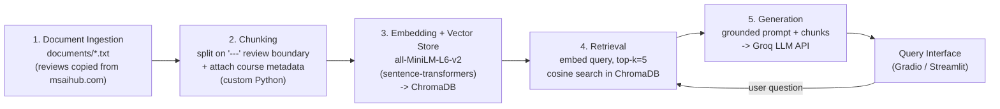

# Project 1 Planning: The Unofficial Guide

> Write this document before you write any pipeline code.
> Your spec and architecture diagram are what you'll use to direct AI tools (Claude, Copilot, etc.) to generate your implementation — the more specific they are, the more useful the generated code will be.
> Update the Retrieval Approach and Chunking Strategy sections if you change your approach during implementation.
> Update this file before starting any stretch features.

---

## Domain

**Domain:** Student experiences in the **UT Austin online Master of Science in Artificial Intelligence (MSAI)** program — specifically per-course reviews covering real workload (hours/week), difficulty, grading harshness, exam/project style, lecture quality, and which courses to take together or avoid.

**Why it's valuable and hard to find officially:** The official UT Austin / edX catalog lists course topics, credit hours, and prerequisites — but it says nothing about what the course is actually *like*: how many hours per week it really takes, whether the autograder is brutal, whether you can pass without the textbook, or which course pairings burn students out. That lived experience is scattered across community hubs (e.g. msaihub.com) and student forums, never in official channels. A prospective or current student deciding their schedule has no single trustworthy place to get a straight answer.

---

## Documents

<!-- Source strategy: one document = the collected student reviews for one MSAI course,
     copied from msaihub.com into a .txt file in documents/. Courses are chosen to SPREAD
     across difficulty (easy -> hard) and AI subfield so retrieval has to distinguish between
     genuinely different topics. Fill in real course names + page URLs as you collect; the
     bracketed [bucket] in Description is just a selection guide for diversity. -->

| # | Source (course) | Description | URL or location |
|---|-----------------|-------------|-----------------|
| 1 | CS 391L — Machine Learning | Student reviews — foundational ML | documents/01_machine_learning.txt |
| 2 | CS 394D — Deep Learning | Student reviews — deep learning | documents/02_deep_learning.txt |
| 3 | CS 388 — Natural Language Processing | Student reviews — NLP | documents/03_nlp.txt |
| 4 | CS 394R — Reinforcement Learning | Student reviews — reinforcement learning | documents/04_reinforcement_learning.txt |
| 5 | CS 395T — Optimization | Student reviews — optimization / math-heavy | documents/05_optimization.txt |
| 6 | CS 395T — Online Learning and Optimization | Student reviews — online learning / optimization (note: shares CS 395T number with #5 — a deliberate disambiguation test) | documents/06_online_learning_optimization.txt |
| 7 | CS 388U — Planning, Search, and Reasoning Under Uncertainty | Student reviews — search / reasoning under uncertainty | documents/07_planning_search_reasoning.txt |
| 8 | CS 389L — Automated Logical Reasoning | Student reviews — formal logic / theory | documents/08_automated_logical_reasoning.txt |
| 9 | CS 400T — Case Studies in Machine Learning | Student reviews — applied / project-based ML | documents/09_case_studies_ml.txt |
| 10 | ICD10 — AI in Healthcare | Student reviews — applied / interdisciplinary domain | documents/10_ai_in_healthcare.txt |

---

## Chunking Strategy

<!-- How will you split documents into chunks?
     State your chunk size (in tokens or characters), overlap size, and explain why those
     numbers fit the structure of your documents.
     A review-heavy corpus warrants different chunking than a long FAQ. -->

**Approach:** Review-boundary chunking. Each file holds multiple student reviews separated by a `---` marker; the primary split is on that marker, so **one chunk = one complete student review**. A size cap is applied only as a safety net for unusually long reviews.

**Chunk size:** Variable, bounded. A chunk is whatever one review contains (typically ~50–250 words). If a single review exceeds **~500 tokens**, it is sub-split into ~500-token windows.

**Overlap:** **~50 tokens**, applied *only* when a long review is sub-split. No overlap is used between separate reviews — bleeding one student's opinion into another's chunk would pollute retrieval (e.g. mixing a "loved it" review into a "hated it" one).

**Preprocessing (before chunking):** strip usernames/timestamps/upvote counts copied from msaihub, normalize whitespace/blank lines, and drop empty entries.

**Course attribution:** every chunk is stored with the **course code + name as Chroma metadata** (e.g. `course: "CS 391L — Machine Learning"`), and the course name is also prepended to the chunk text. This is essential here: a raw chunk like *"~20 hrs/week, autograder is unforgiving"* is useless unless the system knows which course it's about — critical for both retrieval (queries name courses) and source attribution in the answer.

**Reasoning:** Reviews are self-contained semantic units, so splitting on review boundaries keeps each opinion intact and prevents cross-review contamination. Fixed-size windowing would cut opinions in half and merge unrelated students. The ~500-token cap matches the embedding model's comfortable input range while keeping rare long reviews from dominating a single chunk.

**Final chunk count:** _TBD — record after running ingestion across all 10 files._

---

## Retrieval Approach

<!-- Which embedding model are you using (e.g., all-MiniLM-L6-v2 via sentence-transformers)?
     How many chunks will you retrieve per query (top-k)?
     If you were deploying this for real users and cost wasn't a constraint, what tradeoffs
     would you weigh in choosing a different embedding model — context length, multilingual
     support, accuracy on domain-specific text, latency? -->

**Embedding model:** `all-MiniLM-L6-v2` via `sentence-transformers`. It is fast, runs locally (free, no API key), produces 384-dim embeddings, and performs well on short English text — a good match for student reviews.

**Top-k:** **5.** Each course has several short reviews, so retrieving 5 chunks lets the LLM synthesize multiple students' opinions (e.g. consensus on workload) rather than parroting one. Small enough to stay on-topic and fit the LLM context comfortably. Will tune during Milestone 4 if answers feel thin or noisy.

**Production tradeoff reflection:** If cost weren't a constraint and this served real students, I'd weigh:
- **Context length:** MiniLM truncates at ~256 tokens, so a very long review gets cut. A model like OpenAI `text-embedding-3-large` (8191 tokens) or Voyage AI embeddings would capture full long reviews without sub-splitting.
- **Domain accuracy:** MiniLM is general-purpose and may under-weight CS/ML jargon and course codes. A larger or domain-adapted model would retrieve more precisely on terms like "autograder," "CS 395T," or "REINFORCE."
- **Multilingual:** Not needed here (reviews are English), so a multilingual model would add cost for no benefit.
- **Latency vs. local:** MiniLM is local and instant; an API model adds network latency and a dependency/outage risk, traded for higher accuracy. For a small review corpus the local model is the right call; at scale I'd benchmark accuracy gains against the per-query cost.

---

## Evaluation Plan

<!-- List your 5 test questions with their expected correct answers.
     Questions should be specific enough that you can judge whether the system's response
     is right or wrong. "What are good dining halls?" is too vague.
     "What do students say about wait times at [dining hall name] during lunch?" is testable. -->

<!-- Questions are written now; fill Expected answer after reading the collected reviews. -->

| # | Question | Expected answer |
|---|----------|-----------------|
| 1 | How many hours per week do students report spending on CS 391L Machine Learning? | _TBD — fill with the hour range students actually cite_ |
| 2 | According to reviews, which is more difficult: CS 394D Deep Learning or CS 388 Natural Language Processing, and why? | _TBD — name the harder course + the cited reason (math, projects, autograder)_ |
| 3 | What do students recommend doing to prepare before taking CS 394R Reinforcement Learning? | _TBD — list the prereqs/prep students mention_ |
| 4 | How do CS 395T Optimization and CS 395T Online Learning and Optimization differ in workload and content? | _TBD — must correctly distinguish the two same-numbered courses (disambiguation test)_ |
| 5 | How is grading structured in CS 389L Automated Logical Reasoning — exams, projects, or both? | _TBD — describe the grading breakdown students report_ |

---

## Anticipated Challenges

<!-- What could go wrong? Name at least two specific risks with reasoning.
     Consider: noisy or inconsistent documents, missing source attribution, off-topic
     retrieval, chunks that split key information across boundaries. -->

1. **Same-course-code collision (CS 395T).** Optimization and Online Learning and Optimization share the code *and* overlapping vocabulary, so their review embeddings sit close together. A query about one may retrieve chunks from the other, producing a blended or wrong answer. Mitigation: store course name as metadata and prepend it to chunk text so the course identity is part of the embedding, and consider metadata filtering at query time.

2. **Sparse / uneven review coverage.** Newer or niche courses (e.g. ICD10 AI in Healthcare) may have only a handful of reviews. With thin data, top-k retrieval pads results with weakly-relevant chunks, and the LLM may still answer confidently — fabricating a workload number that isn't supported. Mitigation: grounding prompt that allows "the documents don't say," and tracking which courses are under-covered.

3. **Contradictory subjective reviews.** Students disagree (one calls a course "easy," another "brutal"). If retrieval returns both, the model may pick one arbitrarily or wrongly "average" them instead of reporting the range of opinion. Mitigation: prompt the model to surface disagreement rather than collapse it.

---

## Architecture

<!-- Draw a diagram of your pipeline showing the five stages:
     Document Ingestion → Chunking → Embedding + Vector Store → Retrieval → Generation
     Label each stage with the tool or library you're using.
     You can use ASCII art, a Mermaid diagram, or embed a sketch as an image.
     You'll use this diagram as context when prompting AI tools to implement each stage. -->

**Stage → tool summary:**

| Stage | Tool / library |
|-------|----------------|
| Ingestion | plain `.txt` files in `documents/` (manual copy/paste; `pdfplumber` only if any PDFs) |
| Chunking | custom Python (split on `---`, course metadata, ~500-token cap) |
| Embedding | `all-MiniLM-L6-v2` via `sentence-transformers` |
| Vector store | `chromadb` (persistent, cosine similarity) |
| Retrieval | ChromaDB query, top-k = 5 |
| Generation | `groq` LLM API with a grounding system prompt |
| Interface | `gradio` or `streamlit` (Milestone 5) |

---

## AI Tool Plan

<!-- For each part of the pipeline below, describe:
     - Which AI tool you plan to use (Claude, Copilot, ChatGPT, etc.)
     - What you'll give it as input (which sections of this planning.md, which requirements)
     - What you expect it to produce
     - How you'll verify the output matches your spec

     "I'll use AI to help me code" is not a plan.
     "I'll give Claude my Chunking Strategy section and ask it to implement chunk_text()
     with my specified chunk size and overlap" is a plan. -->

**Milestone 3 — Ingestion and chunking:**
Tool: Claude (Claude Code). Input: the **Documents** and **Chunking Strategy** sections above. Ask it to implement `load_documents()` (read every `documents/*.txt`, derive the course name from the filename/table) and `chunk_text()` (split on the `---` review marker, normalize whitespace, enforce the ~500-token cap with ~50-token overlap on long reviews, attach `course` metadata to each chunk). Expected output: a list of `{text, course, source_file}` chunk objects. Verify by printing the chunk count and spot-checking that no chunk merges two reviews and every chunk carries its course tag.

**Milestone 4 — Embedding and retrieval:**
Tool: Claude. Input: the **Retrieval Approach** section. Ask it to embed all chunks with `all-MiniLM-L6-v2`, store them in a persistent ChromaDB collection (text + `course` metadata), and implement `retrieve(query, k=5)`. Expected output: a query function returning the top-5 chunks with course + score. Verify against the **Evaluation Plan** questions — especially that the CS 395T disambiguation query returns the correct course's chunks; if not, add metadata filtering.

**Milestone 5 — Generation and interface:**
Tool: Claude. Input: the **Grounded Generation** intent + retrieval output format. Ask it to build the Groq call with a grounding system prompt (answer only from provided chunks, cite course names, say "the documents don't say" when unsupported, surface disagreement) and a `gradio`/`streamlit` UI. Expected output: a working Q&A app that shows the answer plus the source courses. Verify by running all 5 eval questions and confirming answers are grounded and attributed, then record results in README.md.
